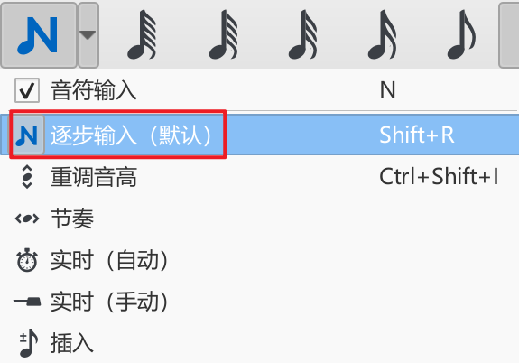
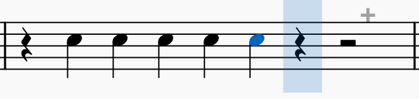
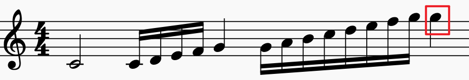
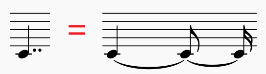
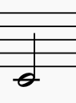

<h2>
    MuseScore常见问题指南
    </h2>

### 问题目录

点击关键词可跳转至对应问题

网页版鼠标悬停在关键词上可显示对应问题。

| 问题序号 |                              1                               |                              2                               |                              3                               |                              4                               |                              5                               |                              6                               |                              7                               |                              8                               |
| :------: | :----------------------------------------------------------: | :----------------------------------------------------------: | :----------------------------------------------------------: | :----------------------------------------------------------: | :----------------------------------------------------------: | :----------------------------------------------------------: | :----------------------------------------------------------: | :----------------------------------------------------------: |
|  关键词  | <a href="#多选" title="如何同时选中多个小节/音符/元素？">多选</a> | <a href="#隐藏" title="我想把谱面上的一些东西隐藏掉，怎么做？">隐藏</a> | <a href="#翻转" title="我想让这个音符的符干倒过来，怎么做？">翻转</a> | <a href="#连续符杠" title="我想让这两个音符的符杠连起来，怎么做？">连续符杠</a> | <a href="#跨休止符连续符杠" title="我想让这两个音符的符杠跨休止符连起来，怎么做？">连续符杠（跨休止符）</a> | <a href="#断开符杠" title="我想让这两个音符的符杠断开来，怎么做?">断开符杠</a> | <a href="#分声部" title="我有一部分音符输入不了，怎么回事？">分声部</a> | <a href="#合并音符" title="我想让这两个音符合起来，怎么做？">合并音符</a> |

| 问题序号 |                              9                               |                              10                              |                              11                              |                              12                              |                              13                              |                          14                           |                              15                              |                              16                              |
| :------: | :----------------------------------------------------------: | :----------------------------------------------------------: | :----------------------------------------------------------: | :----------------------------------------------------------: | :----------------------------------------------------------: | :---------------------------------------------------: | :----------------------------------------------------------: | :----------------------------------------------------------: |
|  关键词  | <a href="#自动布局" title="为什么移动这个力度记号会使谱表之间的距离增大？">自动布局</a> | <a href="#跨谱表音符" title="这种跨谱表的效果怎么做出来？">跨谱表（音符）</a> | <a href="#跨谱表和弦" title="跨谱表的和弦又怎么打出来呢">跨谱表和弦</a> | <a href="#连音符" title="符杠上面有个 3 是什么意思，怎么打出来？">连音符</a> | <a href="#弱起" title="为什么开头这个小节长度短一点，怎么做">弱起</a> | <a href="#华彩" title="这种华彩又该怎么打？">华彩</a> | <a href="#震音" title="符干上面有几条杠是什么意思，怎么打？">震音</a> | <a href="#倚音" title="这个音符前面的小音符是什么意思？怎么打出来？">倚音</a> |

| 问题序号 |                             17                             |    18    |  19  |  20  |      21       |    22     |    23    |   24   |   25   |
| :------: | :--------------------------------------------------------: | :------: | :--: | :--: | :-----------: | :-------: | :------: | :----: | :----: |
|  关键词  | <a href="#附点" title="如何打出附点/复附点音符？">附点</a> | 奏法记号 | 移调 | 散板 | 插入/删除小节 | 换行/页符 | 小节拉伸 | 行距符 | 占位框 |

| 问题序号 |  25  |  26  |   27   |  28  |  29  |  30  |  31  |  32  |
| :------: | :--: | :--: | :----: | :--: | :--: | :--: | :--: | :--: |
|  关键词  | 和弦 | 歌词 | 混音器 |      |      |      |      |      |

### 进阶技巧

|  序号  |    1     |       2        |    3     |    4     |  5   |  6   |  7   |  8   |
| :----: | :------: | :------------: | :------: | :------: | :--: | :--: | :--: | :--: |
| 关键词 | 键盘输入 | 自定义符号面板 | 钢琴卷帘 | 线性记号 |      |      |      |      |

### 〇、读前必看

#### 介绍

**本指南仍在不断更新和修订，请确保你正在读的版本是最新版本。**

本指南以使用 MuseScore 打谱的常见问题为核心，包含详细的图文教程，以及一些进阶技巧，同时还会介绍一些打谱必备的乐理知识。

如果你对 MuseScore 不甚了解，打谱时常常对一些问题一筹莫展、无从下手，那么请你耐心地阅读完本指南，这一定会使你有所收获。

如果你对 MuseScore 比较精通，那么也推荐你阅读本指南，里面包含的一些进阶技巧或许能提高你的打谱效率，同时在忘记某些操作时可快速查阅，你也可以为本指南补充一些自己的经验与见解。

**本指南首发于 QQ群 “MuseScore交流讨论群”（群号 983966541），内容为本人原创，如果你对本指南有任何疑问，或是有想要补充和修正的地方，欢迎在群里 @Chakiri 。**

---

#### Musescore3 和Musescore4 用哪个比较好？

先说结论，如果需要较为复杂专业的打谱功能，请认准目前 MuseScore3 最后一个版本 3.6.2 ，如果打谱需求不复杂，或是打谱仅仅为了一定的回放效果，可以考虑使用 MuseScore4 的最新版本，目前我**仍推荐使用 MuseScore 3.6.2，本指南也是基于 MuseScore 3.6.2 编写的**。

MuseScore4 具有更现代化、更简洁的界面（这也不一定是优点），在 MuseSound 的加持下，还有不错的回放效果。但由于MuseScore4 目前仍处于版本初期，且开发进度一度受到疫情的影响，目前还存在一些问题，还有一些 MuseScore3 中有的功能尚未加入，如钢琴卷帘等。MuseScore 3.6.2 已经算是一个比较完善的版本，稳定性也强于MuseScore4，为了避免出现各种难以排查及解决的软件/硬件层面奇怪的问题，如没有声音、崩溃、闪退等等，建议目前仍使用MuseScore 3.6.2。本指南也是基于MuseScore 3.6.2 编写，如果你使用的是MuseScore4，虽然有些操作逻辑与 MuseScore 3.6.2 不同，但本指南仍有一定的参考价值。

**注意：由MuseScore4 创建的文件无法直接使用 MuseScore3 打开。**

下附一些链接：

MuseScore官网（中文）：https://musescore.org/zh-hans

MuseScore 3.6.2 下载地址（Windows）：https://ftp.osuosl.org/pub/musescore-nightlies/windows/3x/stable/MuseScore-3.6.2.548021803-x86_64.msi

MuseScore 3.6.2 下载地址（Mac）：https://ftp.osuosl.org/pub/musescore-nightlies/macos/3x/stable/MuseScore-3.6.2.548020600.dmg

MuseScore交流讨论群（QQ群）：983966541  （群内也有 Musescore 各版本的安装包，欢迎前来交流讨论）

---

#### MuseScore 能打简谱吗？

这个也是大家非常常问的一个问题，**原生的 MuseScore 3.6.2 及目前的 MuseScore4 都无法直接输入简谱**，虽然可以通过一些插件达到输入简谱的效果，但是操作较为复杂，功能也并不完善，目前并不推荐使用 MuseScore 输入简谱。

如有输入简谱的需求，可以考虑使用以下几个软件：

1. EOP 简谱大师（推荐）：https://www.everyonepiano.cn/Software-7-EOP-%E7%AE%80%E8%B0%B1%E5%A4%A7%E5%B8%88.html

   

   EOP 简谱大师是一个老牌软件，多年以来一直保持更新，且宣称永久免费。EOP 简谱大师操作较为简单，上手容易，关于简谱的许多功能也非常完善，且还支持VSTi 音源和 midi，具体功能介绍可以点击上方链接进入官网查看。

2. JP-Word：https://www.happyeo.com/intro_jpw.htm

   

   JP-Word 功能也十分强大，缺点是免费版有功能限制且有水印。

3. 番茄简谱：http://www.jianpu99.net

   

   番茄简谱有网页版，无需安装，可以直接在网页端输入简谱。番茄简谱通过脚本输入简谱，具有一定的上手门槛，但熟练以后效率很高。缺点是功能并不完善。

---

### 一、如何同时选中多个小节/音符/元素？

方法1：适合选中连续的小节/音符，先点击选中选区开头的小节/音符，按住 shift ，点击选中选区末尾的小节/音符。

方法2：适合选中离散的音符/元素，按住 ctrl ，点击需要选中的音符/元素。

方法3：适合选中一个区域内的音符/元素，按住 shift ，按住鼠标左键后拖动鼠标框选范围，最后松开，如图所示：

最终效果如下：

---

**Tips:**

多选可以实现批量操作，非常便捷。针对不同选择需求，记得要使用适合的方法！

---

#### （进阶）使用过滤器多选元素

有时候需要选择一类元素，如第一声部、和弦记号等等，这时候使用过滤器会非常方便。

将**顶部菜单栏-视图-过滤器**勾选，打开过滤器。

以**选中第一声部**为例：

第一步，将**全部**前的勾取消，如图所示：

第二步，**勾选第一声部**，如图所示：

第三步，**选中所需选区**，此时选取对象仅为第一声部的元素，最终效果如下：

---

**Tips:**

可以熟悉一下过滤器支持哪些类型的元素，当需要选中大量同一类型的元素时，别忘了使用过滤器！

---

#### （进阶）使用选择音符面板多选元素

**针对音符**，还可以使用选择音符面板快速选择一类具有某一特征的音符，非常便捷。

举个例子，想要把这两个小节中的 E 全部变成 Eb ，如何快速操作？

---

如果使用 ctrl 键来点击选中所有音符E 显然效率不高，而且容易出错，当音符量大时更是费时费力，这时就是选择音符面板大展身手的时候了。

第一步，**选中这两个小节**，如图所示：

第二步，**鼠标移动到任意一个音符E的符头上，点击鼠标右键**，如图所示：

第三步，鼠标移动到**选择**上，在右侧菜单中选择**更多..**.，此时会弹出**选择音符**面板，如图所示：

第四步，勾选**同一音名和选中前的复选框**，如图所示：

第五步，**点击OK**，可以看到这两个小节内的所有音符 E 都被选中了，如图所示：

第六步，**按下方向键↓**，此时所有音符 E 就变为了 Eb ，最终效果如下：

---

**Tips:**

利用选择音符面板其实还能完成很多很多操作，可以尝试组合不同的复选框以及下方命令中的单选框以达成不同的需求，善用选择面板一定能让你打谱如虎添翼！

---

### 二、我想把谱面上的一些东西隐藏掉，怎么做？

**选中你想要隐藏的元素**，**按下 v 键**即可隐藏，或者在**元素检视器**中将**“可见”**前的勾去掉，两种方法等价。

可以隐藏的元素有休止符、符头、符干、符杠、小节线、拍号、调号等等。

***可批量操作**，即选中所有需要隐藏的元素后按 v ，该操作会反转所有选中元素的不可见状态*

#### 元素检视器在哪，没看到啊？

确保**顶部菜单栏-视图-元素检视器**为勾选状态，如果未勾选，请**点击将其勾选**。

*元素检视器是非常常用的一个面板，建议让其始终显示，可以将其拖动到屏幕左侧与符号面板共用窗口（个人习惯，屏幕大的话放右边也可以）*

#### 隐藏后的元素为什么还显示在谱面上？

隐藏后的元素会变为半透明。隐藏的元素**并不会出现在导出的 pdf 中**。如果在谱面上也不想看到隐藏的元素，可以**取消勾选 视图-显示不可见元素**。

---

### 三、我想让这个音符的符干倒过来，怎么做？

如下图所示，这个音符符干默认是朝下的，我想让它朝上，怎么做？

----

**选中该音符（建议点击符头）**，**按下 x 键**即可，或者在上方工具栏中**点击翻转方向按钮**，两种方法等价。

最终效果如下：

---

**Tips:**

只需选中一个音符，**与其符杠相连的音符会被一同翻转**，效果如下：

**某些元素也可以通过翻转来快速调整位置**，如翻转表情记号快速调整其在谱表的上方还是下方，效果如下：

---

### 四、我想让这两个音符的符杠连起来，怎么做？

---

第一步，选中**断开处后方**的音符，如图所示：

第二步，点击左侧**符号面板-符杠属性-连续符杠**，如图所示：

最终效果如下：

#### 左侧没有符号面板，怎么办？

确保**顶部菜单栏-视图-符号面板**为勾选状态，如果未勾选，请**点击将其勾选**。

#### 符号面板中没有符杠属性，怎么办？

第一步，在符号面板的顶部**点击添加面板按钮**，如图所示：

第二步，在弹出窗口符杠属性的一栏中**点击添加按钮**。如图所示：

现在在符号面板的顶部应该就会出现符杠属性选项卡，可以**拖动调整选项卡的顺序**。

---

**Tips:**

添加其他选项卡同理。

---

### 五、我想让这两个音符的符杠跨休止符连起来，怎么做？

---

第一步，先**选中两个音符之间的休止符**，如图所示：

第二步，点击左侧**符号面板-符杠属性-连续符杠**，最终效果如下：

---

**Tips:**

如果按方法操作后还未连起来，**请确保需要连起来的音符的符杠属性均为连续符杠**。

---

### 六、我想让这两个音符的符杠断开来，怎么做？

与让音符符杠相连类似，第一步同样是**选中需要断开处后方的音符**，如图所示：

第二步，点击左侧**符号面板-符杠属性-首末端符杠**，如图所示：

最终效果如下：

---

**Tips:**

还可以尝试一下其他符杠属性的效果！

---

#### （进阶）通过拍号属性调整符杠的连续性

如果音符符杠的连续性需要批量地调整（一般为音值组合问题），可以通过拍号属性来调整模板，方法如下：

**选中拍号右键-拍号属性**，如图所示：

可以**在音符组中修改模板**（方法与调整谱面上音符符杠类似），例如将八分音符的组合方式改为如下图所示后点击OK。

则该拍号作用域内的音符符杠将会以这个模板组合，最终效果如下：

---

### 七、我有一部分音符输入不了，怎么回事？

我输入完上面的八分音符后，再输入底下的二分音符，这时候八分音符就全没了，下图是怎么做到的？

---

上面的八分音符和下面的二分音符是两个声部，需要分声部进行输入。

第一步，输入下面的二分音符前，需要切换至第二声部。**按 ctrl + alt + 2，或是在上方工具栏右侧点击按钮'2'**，如图所示：

此时输入区域会变为绿色，如图所示：

第二步，**正常完成输入**，如图所示：

第三步，**点击谱面空白处**，取消焦点，如图所示：

第四步，输入上面的八分音符前，需要切换回第一声部。**按 ctrl + alt + 1，或是在上方工具栏右侧点击按钮'1'**，如图所示：

此时输入区域会变回蓝色，如图所示：

第五步，正常完成输入，最终效果如下：

---

**如果你理解声部的概念以及上述操作逻辑，分声部输入可以变得很灵活**，比如选中音符使其切换到其他声部等等。

除了第一声部外，其他声部多余的休止符可以直接选中按 delete 键删除，最终效果如下：

---

### 八、我想让这两个音符合起来，怎么做？

----

**选中其中一个音符的符头将其隐藏**即可，最终效果如下：

---

**Tips:**

二分音符和四分音符的符头不会自动合并，如果需要合并的话，可以使用上面的方法。

当一个符头同时出现上下两条符干时，说明**两个声部同时演奏这个音**，如下图中第一个音：

将两个声部分离更为直观，第一声部：

第二声部：

此时演奏方式为：正常弹奏第一声部，但由于第二声部的存在，第一声部的第一个音 C 应**保持按住**，且时值为四分音符，即**持续到最后一个音 G 结束后放开**。

### 九、为什么移动这个力度记号会使谱表之间的距离增大？

我想要调整这个力度记号的位置，可是每次往下拉都会让谱表之间的距离增大，怎么回事？

---

因为大部分元素均**默认勾选了自动布局**，因此在某些情况下拖动力度记号等元素时会产生这种**“排斥”现象**，如果想要精细地安排元素位置、或是将元素插入一些谱面空隙中，可以试着取消元素的自动布局，方法如下：

**选中需要取消自动布局的元素**，**按下=键**，或是在**元素检视器**中**取消勾选自动布局**，这两种方法是等价的，效果如下：

之后就可以任意安排元素的位置了，最终效果如下：

---

**Tips:**

取消自动布局的元素会处于类似**绝对定位**的状态（如果你对 CSS 有所了解就会很容易理解），独立于其他谱面元素，此时可以将该元素摆放到谱面上的任意位置而不影响其他元素的摆放。

---

### 十、这种跨谱表的效果怎么做出来？

---

第一步，在**低音谱表或高音谱表**中，输入所有音符，如图所示：

第二步（可选）、**根据需要调整符杠的连续性**（如何调整详见问题5），如图所示：

第三步，选中**所有需要翻上/下去的音符**，如图所示：

第四步，**按下ctrl + shift + ↑/↓**（↑为翻上去，↓为翻下去），如图所示：

第五步，根据需要最后进行调整，如隐藏不必要的休止符（如何调整详见问题 2）等，最终效果如下：

---

**Tips:**

实际打谱时，别忘了结合问题1中多选的技巧，批量上/下翻需要跨谱表的音符。

---

### 十一、跨谱表的和弦又怎么打出来呢？

---

**目前MuseScore还没有输入跨谱表和弦的功能**，但是**仍可以实现谱面效果**，方法如下：

第一步，**分别输入每个谱表中的音符**，如图所示：

第二步（可选），**根据需要调整符干方向**，（如何调整详见问题 4），如图所示：

第三步，选中需要连接的符干，**按下=键取消其自动布局**（详见问题 9），如图所示：

第四步，**拖动方块调整符干至合适长度**，使上下谱表和弦的符干连接起来，最终效果如下：

---

**Tips:**

如果没有第三步，即不取消自动布局，直接调整符干长度会出现“排斥”现象，如图所示：

---

### 十二、符杠上面有个 3 是什么意思？怎么打出来？

我想要达到图中这个样子：

实际打出来却是这样：

符杠上面没有 3，符杠的连接方式也不太对，小节长度也不够了，怎么回事？

---

符杠上面有个 3 代表“三连音”，**打三连音时最好提前创建**，因此需要删除打好的部分，回到空小节的状态，如图所示：

第一步：选中该小节，按顺序分别**按下 n 键**（进入输入模式）、**数字键 5**（时值为四分音符）、**数字键 0**（创建休止符），使全休止符分离出四分休止符（也可通过鼠标点击图形界面实现），如图所示：

第二步：**按下n键**退出输入模式（也可通过鼠标点击图形界面实现），如图所示：

第三步：**选中前两个四分休止符**，如图所示：

第四步：**按下ctrl + 3**创建三连音，如图所示：

第五步：**正常键入所需音符**，最终效果如下：

---

#### （进阶）有关连音符的知识与操作

音符的基本时值单位划分都是二等分，如两个八分音符等于一个四分音符，两个四分音符等于一个二分音符等。如果想要其他的划分方法，比如1/3个四分音符，这时候就需要使用连音符。

以最常见的三连音为例，三连音是将原本两个音所占的时值平均分为三份。八分音符三连音就是将原本两个八分音符所占的时值，即一个四分音符分为三份，因此三连音中的每个八分音符的时值为1/3个四分音符，这也是选中四分休止符来创建八分音符三连音的原因。

一般来说，当连音数 $n$ 为大于等于 3 的奇数时，存在正整数 $k$ ，使得$2^k < n < 2^{k+1}$，则此时 $n$ 连音表示将原本 $2^k$ 个音所占的时值平均（当连音数n很大时，实际演奏时一般不会平均处理）划分为 $n$ 份。如 $2^3 < 11 < 2^4$，则 11 连音表示将原本 8 个音所占时值平均分为11 份，十六分音符十一连音就是将原本八个十六分音符，即一个二分音符所占时值平均分为十一份，如图所示：

**当连音数 n 为偶数时，一般此时是在划分附点音符**，这里不做过多展开，感兴趣的可以自行搜索了解。

连音数会以**数字或数字+括号等形式附加在符杠上**。

**那么，在musescore中如何输入这些连音呢？**

当连音数 n 大于等于 2 小于等于 9 时，可以先**选中需要划分时值的对应休止符**，然后**按下ctrl + 连音数所对应的数字键**。

如要创建八分音符七连音，根据刚刚有关连音符的知识可知，总时值应为四个八分音符即一个二分音符，则**先选中一个二分休止符**，然后**按下ctrl + 7**即可，最终效果如下：

当连音数大于 9 时，此时不能直接通过快捷键创建连音符，需要通过**创建连音**面板创建，以创建十六分音符十一连音为例，根据刚刚有关连音符的知识可知，总时值应为八个十六分音符即一个二分音符，则第一步先**选中一个二分休止符**，如图所示：

第二步，点击**上方菜单栏-添加-连音符-其它...**，此时会弹出创建连音面板，如图所示：

第三步，**在比率一栏中填写 11 / 8**，即连音数 **n** / $2^k$，如图所示：

第四步，**点击OK**，16 分音符11连音创建完成，最终效果如下：

---

**Tips:**

如果需要打连音，切记一定要**先创建好连音**再输入音符！

---

### 十三、为什么开头这个小节长度短一点？怎么做？

明明是 44 拍，第一个小节却只有一个八分音符，这该怎么打出来？

---

这种现象一般被称为**弱起**，此时第一个小节必然是**不完整小节**，即**实际时值小于谱面时值**。在**小节属性**面板中，可以调整小节的实际时值，方法如下：

第一步，**选中需要调整的小节**，**点击鼠标右键-小节属性**，此时会弹出**小节属性**面板，如图所示：

第二步，**将实际长度一栏中的值修改为 1 / 8**，即实际时值为 1 个 8 分音符，如图所示：

第三步，**点击OK**，如图所示：

第四步，**正常输入音符**，最终效果如下：

---

**Tips:**

不完整小节的右上方会有一个灰色的"-"，提示该小节的实际时值小于谱面时值，**这个"-"为非打印内容，不会显示在导出的 pdf 中**。

**第一个不完整小节一般不算小节数**，可以在小节属性面板中勾选从小节数中排除。

调整前，第二行第一个小节的小节号为 5 ，如图所示：

**选中第一小节，打开小节属性面板，勾选从小节数中排除**，如图所示：

**点击OK**，此时第二行第一个小节的小节号变为 4 ，效果如下：

---

### 十四、这种华彩又该怎么打？

华彩这一个小节里面有好多音符，打不下了，怎么办？

---

#### （不推荐）通过小节面板调整小节实际长度

这种华彩小节一般都会出现 “很多音符挤在一个小节中” 的情况，此时该小节的**实际长度必然大于谱面长度**，有了上个问题的经验，自然会想到通过小节属性面板来调整小节实际长度，方法如下：

第一步，**选中该小节，打开小节属性面板**，如图所示：

第二步，该小节中有一个二分音符、两个四分音符和十二个十六分音符，总时值为 2+2+3=7 个四分音符，因此**将实际长度一栏改为 7 / 4** ，如图所示：

第三步，**按下OK**，此时小节实际长度发生变化，如图所示：

第四步，**正常输入音符**，最终效果如下：

---

#### （推荐）使用插入模式输入音符

如果要使用小节面板调整小节实际长度的话，就**必须要预先知道该小节的总时值**，如果对时值的计算不熟练，或是谱面时值不规整，则会大大降低打谱效率，甚至出错漏音，因此这里介绍一种更为便捷的方法来输入这种实际长度大于谱面长度的小节——**插入模式**。

首先介绍一下插入模式，插入模式是音符输入模式的一种，在**左上角的N按钮**中可以切换输入模式，默认的输入模式为**逐步输入**，如图所示：

**点击插入**，切换到插入模式，如图所示：

顾名思义，插入模式状态下会**在光标前插入音符**，并且会**自动增加小节实际长度**。

为了让大家更清楚地理解插入模式的工作原理，下面稍微演示一下插入模式的使用，先分离出四分休止符，如图所示：

**选中第二个四分休止符，进入插入模式**，此时光标落在第二个四分休止符上，如图所示：

随意输入音符，可以看到音符被插入到光标前面，并且小节长度也随之增加，如图所示：

---

了解插入模式的工作原理后，输入这种实际长度大于谱面长度的小节就变得轻而易举，观察该华彩小节，可以发现最后有一个四分音符，如图所示：

第一步，在小节末尾**分离出一个四分休止符**，并**将四分音符输入上去（逐步输入模式）**，如图所示：

第二步，**选中末尾的四分音符**，**切换到插入模式**，确保光标落在末尾的四分音符上，如图所示：

第三步，**按顺序输入其余音符**，如图所示：

第四步，**选中小节开头多余的休止符，按下 ctrl + delete 删除**，最终效果如下：

---

**Tips:**

结合使用逐步输入模式和插入模式可以灵活地输入音符，使用 ctrl + delete 可以删除多余的休止符。

---

### 十五、符干上面有几条杠是什么意思？怎么打？

---

音符符干上有这样的横杠表示**震音**，在了解如何输入震音前，有必要先简要介绍一下震音的相关知识：

震音记号表示**同音快速反复**，使用横杠在音符符干（没有符干的，如全音符，直接标记在符头上/下端）上进行标记，横杠类似于音符的符尾，一条横杠代表八分音符同音反复，两条横杠代表十六分音符同音反复，以此类推，同音反复的总时值等于原音符时值。下面是一些例子，**左为谱面记号，右为实际奏法**：

---

输入震音非常简单，方法如下：

第一步：**正常输入原音符**，如图所示：

第二步：**选中该音符**，在**符号面板-震音**中找到所需震干并**点击**，如图所示：

最终效果如下：

**若符号面板中没有震音，请参考问题 5 添加。**

---

若**震音记号标记在两个音/双音/和弦中间**，则称为**震间**，如图所示：

该记号表示在两个音之间快速反复，同样地，横杠的数量代表反复音符的时值。有一点需要注意，**震间两端的音符时值必须一致，且实际总时值仅为谱面上其中一个音符所占时值**，如上图中实际总时值应为一个全音符而不是两个全音符。下面是一些例子，**左为谱面记号，右为实际奏法**：

---

输入震间也非常简单，如要输入下图中的震间，方法如下：

第一步，**计算震间两端音符的时值**，由震间记号的规定，**震间两端音符时值必须相等，且实际总时值应为谱面上其中一个音符所占时值**。根据图中所示，震间两端音符的时值应均为全音符的一半，即二分音符。

第二步，根据上一步计算得出的时值正常输入两个音符，如图所示：

第三步：**选中第一个音符**，如图所示：

第四步：，在**符号面板-震音**中找到所需震间并**点击**，如图所示：

最终效果如下：

---

### 十六、这个音符前面的小音符是什么意思？怎么打出来？

---

这种”小音符“叫做**倚音**，在了解如何输入倚音前，有必要先简要介绍一下倚音的相关知识：

倚音是**装饰音的一种**，可分为**短倚音和长倚音**，下面分别介绍：

1. 短倚音（又名碎音）

   **短倚音不占理论时值**，在演奏时**快速带过**（实际演奏时还是会占用一点主要音的时值），起到装饰作用。若短倚音可出现在主要音的前方，则被称为**前倚音**；若出现在主要音的后方，则被称为**后倚音**（相对于前倚音，后倚音较为少见）。单个的短倚音（单倚音）用**较小的八分音符表示，且在符干上加一斜杠**，表示不占理论时值，多个短倚音（复倚音）用**较小的十六分音符表示**。下面是一些短倚音的例子，**左为谱面记号，右为实际奏法**：

   前单倚音：

   

   前复倚音：

   

   后单倚音：

   

2. 长倚音

   长倚音同样不占理论时值，在演奏时一般会占据主要音时值的一半，若主要音为附点音符，则占据主要音时值的 3/2 。长倚音不会出现复数个，且总是出现在主要音前方，一般使用**较小的四分音符或八分音符**表示。下面是一些长倚音的例子，，**左为谱面记号，右为实际奏法**：

   

   

   **注意：图中提供的实际奏法仅供参考，并不意味着必须精确地按照此节奏演奏**。实际上，倚音的演奏方式并不固定，会受到演奏者、作曲者、作曲者所处时代、曲谱标记、乐器等因素影响，比如前复倚音有时并不会演奏地那么快，长倚音在巴洛克时期也有不同的演奏方法。倚音的演奏方式还是需要具体情况具体分析。

---

在 MuseScore 中输入倚音的方法如下，以下图为例：

第一步：**输入主要音**，即不带倚音的音符，如图所示：

第二步：**选中该音符**，按下 / 键（短倚音的快捷键），或在**符号面板-倚音**中找到所需倚音并**点击**，如图所示：

第三步：倚音默认音高与主要音相同，**需使用方向键↑/↓、上下拖动倚音、或其他方式调整倚音至合适的音高**，如图所示：

第四步：**选中倚音**，**按下 s 键**为倚音和主要音之间添加圆滑线，如图所示：

第五步：若圆滑线效果不好，可以选中圆滑线后拖动锚点来调整圆滑线的形状、大小和位置，如图所示：

最终效果如下：

**若符号面板中没有倚音，请参考问题 5 添加。**

---

**Tips:**

为复倚音添加圆滑线时，应选中**第一个音**按 s 键，如图所示：

由于倚音是从符号面板中点击添加，而不是通过输入音符的方式输入，因此**当倚音出现双音或是和弦时，需要特别的输入技巧**，如图所示：

以上图为例，输入这种双音甚至和弦倚音的方法如下：

第一步：**输入主要音符**，如图所示：

第二步：**选中其中一个主要音符并添加倚音**（一般选择最下端的音符），如图所示：

第三步：**调整倚音至合适音高**，如图所示：

第四步（关键）：**保持刚才输入的倚音为选中状态**，**按下 alt + 数字键**（此处为 alt + 4），此时上方出现第二个倚音，如图所示：

第五步：调整倚音至合适音高并添加圆滑线，最终效果如下：

如果还有更多的倚音，重复第三步与第四步即可。

注：alt + 数字键 其实是输入和弦的快速技巧，其中数字键对应的数字为当前选中音到要输入音的度数。如果前面这句话不理解也没有关系，因为这需要关于**音程**的知识，**只需要按下alt + 任意一个数字键就能出现第二个倚音，之后手动调整位置即可**。关于这一快速输入和弦的技巧会在进阶篇的“键盘输入”一节中详细介绍。

---

### 十七、如何打出附点/复附点音符？

在了解如何输入附点音符前，先简单介绍附点音符的相关知识：

**符头后跟着一个或多个点**的音符被称为**附点音符**，下图中是一些例子：

**附点表示对音符时值的延长**，符头后有一个附点称为**附点[ ]音符**（'[ ]'指原音符的名称，如附点四分音符、附点二分音符等），一个附点表示**延长音符原时值的一半**；有两个附点则被称为**双/复附点[ ]音符**，总时值在一个附点音符的基础上，再延长音符原时值一半的一半，即总时值为 1 + 0.5 + 0.25 = **1.75 倍**的音符原时值；有 $n$ 个附点的音符被称为 **$n$ 重复附点[ ]音符**（注意是 n 重 / 复附点音符，而不是 n 重复 / 附点音符），其总时值为原音符时值的 $k$ 倍，其中 $k$ 与 $n$ 有以下关系：
$$
k = \sum\limits_{i=0}^{n} { {1} \over {2^{i} } }
$$
为了更加清晰地理解附点音符的时值，可以将其拆解，以下是一些例子，**左边与右边时值相等**：

---

打出附点音符较为简单，以打**附点二分音符**为例，方法如下：

第一步，**正常打出原音符**（不带附点的音符），即二分音符，如图所示：

第二步，**选中该音符**，**按下.键**（即句号键），或在上方工具栏中**点击附点**，如图所示：

最终效果如下：

**这种方法是在打完原音符后使其变成附点音符，实际打谱中不太推荐**（因为会多出第二步中选中音符的操作，拖慢效率），更推荐的做法是**在输入该音符前选择相应附点音符时值**，方法如下：

第一步，**进入输入状态**（按下n键或点击左上方类似N的按钮），**按下数字键6**（选择时值为二分音符，也可使用鼠标点击二分音符按钮），**按下.键**（添加附点，也可使用鼠标点击附点按钮），如图所示（上方数字表示顺序，下方为快捷键）：

第二步，**正常输入音符**，此时会直接输入附点二分音符，最终效果如下：

---

若要输入两个以上的复附点音符，此时需要先切换工作区到高级，方法如下：

第一步，**点击工具栏右侧切换工作区按钮**（默认为基础，图中显示基础（已修改）是因为我修改了符号面板），如图所示：

第二步，**在下拉菜单中选择高级**，如图所示：

此时工具栏出现了复附点音符及多重附点音符等新按钮，如图所示：

现在就可以仿照刚才讲过的输入附点音符的步骤输入复附点音符了。

---

**Tips:**

一般来说，建议切换至高级工作区，这样方便输入更复杂的东西。

---

MuseScore 常见问题指南 by Chakiri is licensed under <a href="http://creativecommons.org/licenses/by-nc-sa/4.0/?ref=chooser-v1" target="_blank" rel="license noopener noreferrer" style="display:inline-block;">CC BY-NC-SA 4.0</a>

